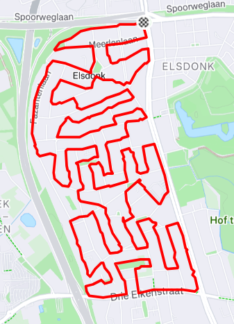

# snake-route
During running, I define a snake route as a route where you run without crossing your own path.

To keep it challenging, there are two other conditions the route must comply with:
- You shouldn't cross large streets (and stay within the same neighbourhood)
- You shouldn't cross traffic light intersections

The challenge with snake routes is to find the ones that cover the largest distance within your neighbourhood.

This gives for example routes like this one:

Planning such longest route can take quite some time, and you are not always sure whether it is actually
the longest snake route in your neighbourhood, given your starting point. This repo helps finding the 
longest possible route within a neighbourhood. 